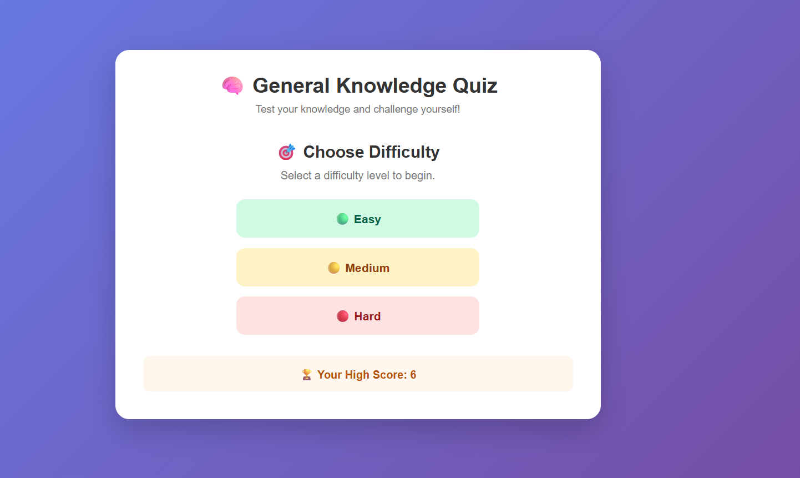
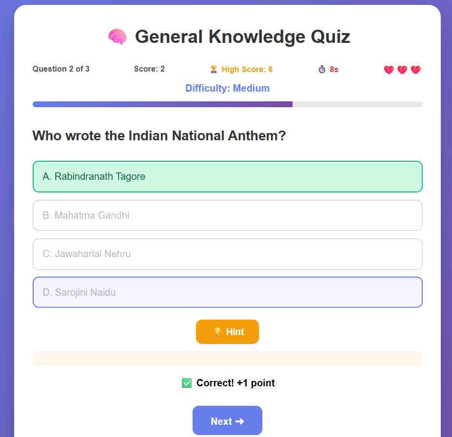
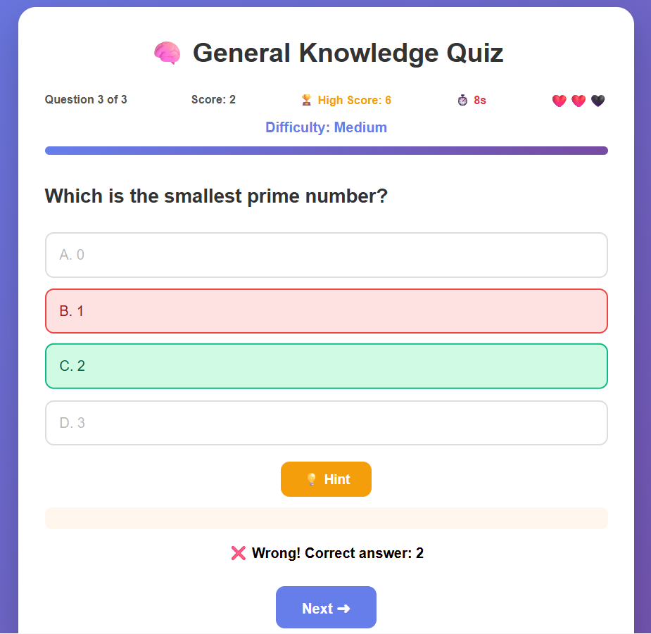
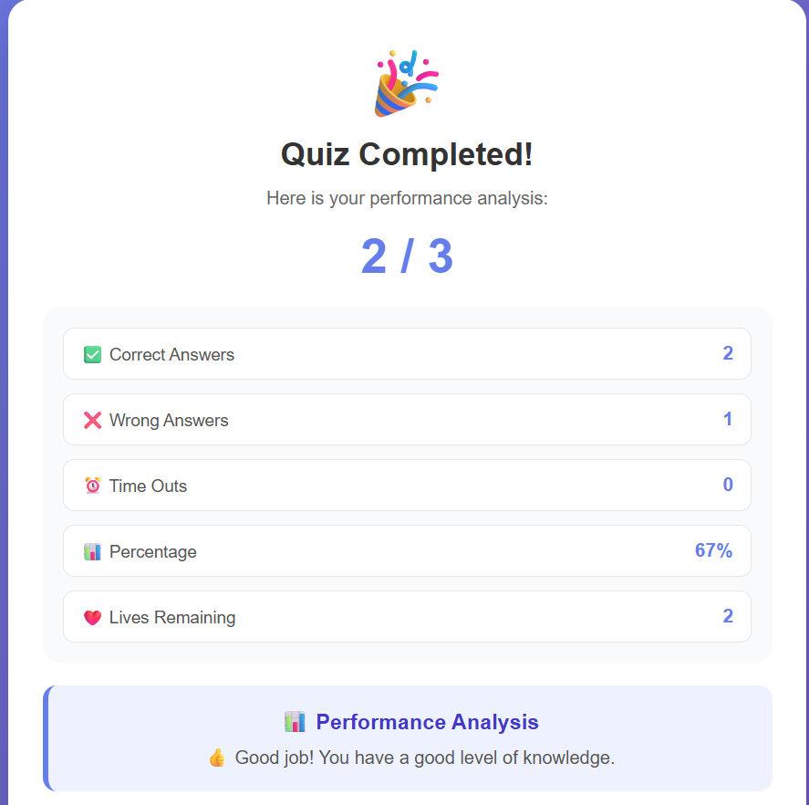

# 🧠 General Knowledge Quiz

A simple and interactive **General Knowledge Quiz** website built using **HTML, CSS, and JavaScript**.

Test your knowledge by answering multiple-choice questions and get instant feedback on your answers. 🎯

---

## ✨ Features

- 🧠 General Knowledge Questions
- 🔘 Multiple-choice answers
- ✅ Instant correct-answer feedback
- ❌ Wrong-answer feedback
- 🏆 Score tracking
- 🔄 Interactive quiz experience
- 🎨 Clean and simple user interface
- 📱 Responsive design

---

## 🛠️ Technologies Used

- **HTML5**
- **CSS3**
- **JavaScript**

---

## 📂 Project Structure

```text
general-knowledge-quiz/
│
├── index.html
├── style.css
├── script.js
├── README.md
│
├── quiz1.png
├── quiz2.png
├── quiz3.png
└── quiz4.png
```

---

## 🎮 How to Play

1. Open the `index.html` file in your browser.
2. Read the question displayed on the screen.
3. Select your answer from the available options.
4. Get instant feedback.
5. Continue answering the questions.
6. View your final score at the end. 🏆

---

## 📸 Screenshots

### 🏠 Home Screen



---

### ✅ Correct Answer



---

### ❌ Wrong Answer



---

### 🏆 Quiz Result



---

## 💻 How to Run

### 1. Clone the repository

```bash
git clone https://github.com/keerthiv2826-blip/general-knowledge-quiz.git
```

### 2. Open the project folder

```bash
cd general-knowledge-quiz
```

### 3. Run the project

Open the following file in your web browser:

```text
index.html
```

No additional installation or dependencies are required.

---

## 📚 Learning Objectives

This project demonstrates:

- HTML page structure
- CSS styling
- JavaScript programming
- DOM manipulation
- Event handling
- Functions
- Conditional statements
- Quiz logic
- Score calculation

---

## 🔮 Future Improvements

- ⏱️ Add a countdown timer
- 🏅 Add a high-score system
- 🔀 Randomize questions
- 📚 Add different quiz categories
- 🌙 Add dark mode
- 🔊 Add sound effects
- 📱 Improve mobile responsiveness

---

## 👨‍💻 Author

**Keerthiv**

GitHub:  
https://github.com/keerthiv2826-blip

---

## 📄 License

This project is created for **learning and educational purposes**.
